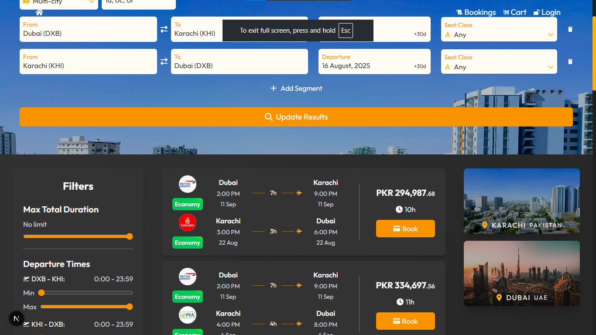
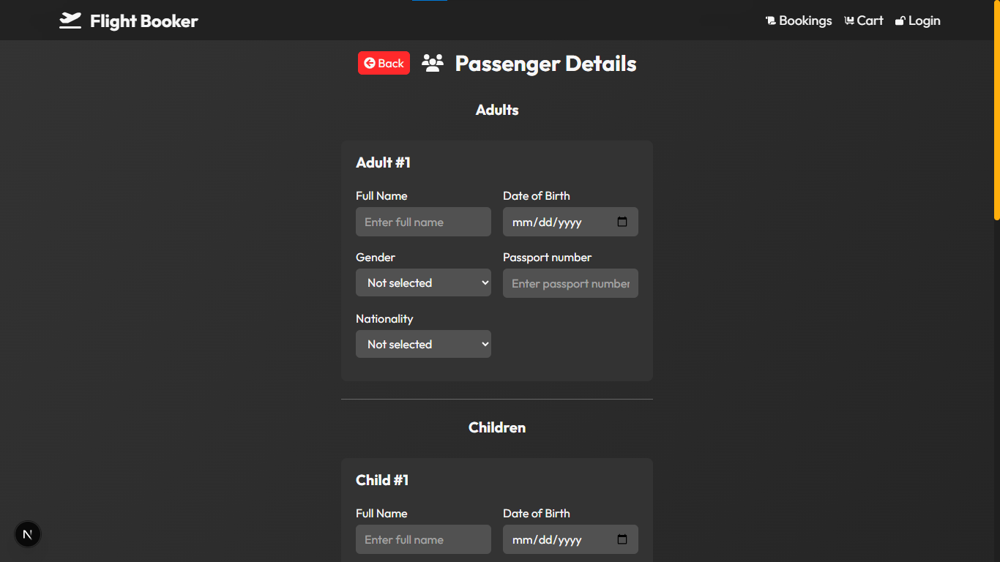
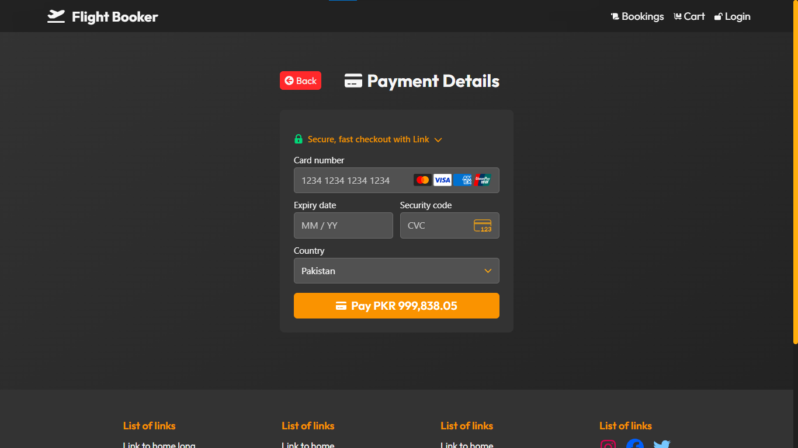
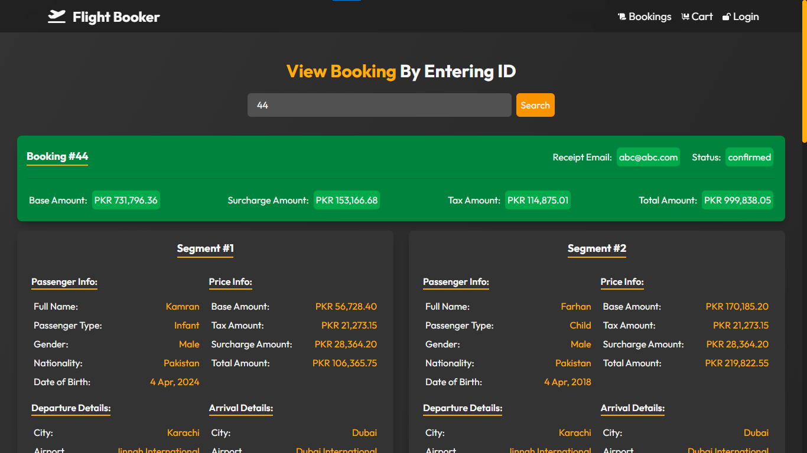

# ✈️ Flights Booking Fullstack Webapp using Next.js, PostgreSQL, Zod, Express, Zustand, Stripe etc.

## 🎯 Features:
1. 🔍 Search flights:
    - ✅ Choose type of journey (One-way, Return trip, Multi-city)
    - ✅ Choose seat class (economy, premium, first class, business)
    - ✅ Choose number of passengers from each category (adults, children and infants)
    - ✅ Choose departure and arrival dates along with flexibility days
2. 🔖 Book flights (with stripe payment integration):
    - ✅ View details in cart
    - ✅ Enter passenger details
    - ✅ Enter payment details
3. 📒 View booking details for each segment and passenger
4. 🔒 Login to store added passengers and receipt email for later

### Screenshots

